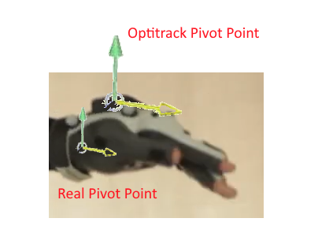
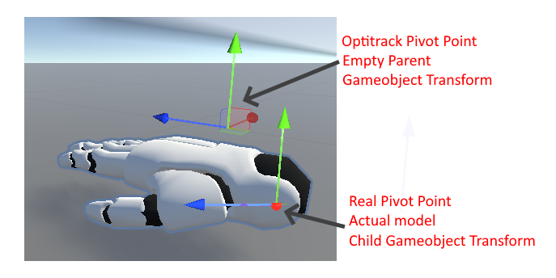
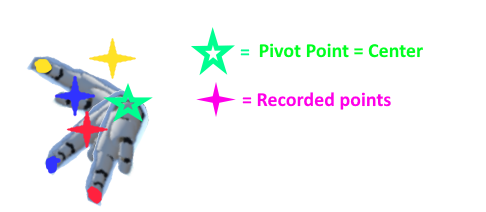

# Initialisation
Make sure the Optitrack streaming client is set-up correctly, with the correct IP adresses. The Manus glove should be calibrated in the Manu Core application as well as loaded inside Unity.

# Calibration
Before starting the experiment, the pivot point of the glove needs to be calibrated. The reason of this, is that the geometric center of the markers on top of the gloves is not equal to the pivot point of the hand. This means that when the participant rotates their hand, the rotation of the virtual hand does not match. The image below shows this offset.



In the current implementation, the geometric center of the trackers is determined by Optitrack, which is then sent to Unity. In Unity, this position is directly transferred as the position of a certain parent gameobject, which itself is empty. A virtual offset is artificially created by assigning a child gameobject to this parent gameobject. This child gameobject consists of the model, which the user can see. With this, we created our own pivot point in Unity. This is visualised in the image below.



However, the pivot point still needs to be calibrated. By positionally locking the to be calibrated object, and simply rotating it, the real pivot position can be found. With every rotation the object makes, the global position sent by optitrack can be saved. Finding the center of these global position will give the actual pivot point. A visualisation of this method can be found below.


Finding the center can be done through sphere fitting. A virtual sphere is made with all these global positions. In the current case, the exact solution is used as described in https://arxiv.org/abs/1506.02776. Now, having found the real pivot position, it is assigned to the child gameobject. This method assumes that the rotation of the glove is already calibrated.
## Code
In the Calibration.cs file the code for the calibration procedure can be found.
The following is called when the participant starts this calibration procedure. It calls the coroutine which handles the entire process.
```
    public void StartCalibration()
    {
        introductionPanel.SetActive(false);
        StartCoroutine(CalibrationHandler());
    }
```
The coroutine was made to repeat the calibration steps for each object. The logic is the same for each gameobject which needs to be calibrated; an example for one object can be found below. It sets the 'running' variable as true, which turns false once the calibration for a certain object is done. The checking for whether it becomes false is done with the 'WaitUntil' function. Afterwards, the coroutine ends.
```
 IEnumerator CalibrationHandler()
    {
            //reset calibration points list
            calibrationPoints.Clear();
            running = true;
            //calibrate right hand rotation
            StartCoroutine(RotationCalibration());
            yield return new WaitUntil(CanContinueCalibration);
            running = true;
            //calibrate right hand position
            StartCoroutine(CalibratePosition());
            yield return new WaitUntil(CanContinueCalibration);
            endPanel.SetActive(true);
    }
```
The following function calibrates the rotational offset of the glove to the actual rotation. "realHandRotation" is the desired rotation and set before the scene starts in the inspector window. The desired rotation is the rotation which the hand should be, if the player follows the instruction at the first step of the calibration.
```
        IEnumerator RotationCalibration()
        {
            panels[0].SetActive(true);
            helpers[0].SetActive(true);
            pressed = false;
            yield return new WaitUntil(ContinueNextCalibrationPoint);
            calibrationPoints.Add(rightHand.transform.position);
            rightHand.transform.localEulerAngles = realHandRotation - rightHand.transform.rotation.eulerAngles;
            rightHand.GetComponent<Skeleton>().enabled = true;
            panels[0].SetActive(false);
            helpers[0].SetActive(false);
            running = false;
        }
```
The coroutine below determines all the calibration points. A calibration point is the global position recorded when a specific action has been made by the user. These global positions can then be used for the sphere fitting algorithm in order to find the pivot point. The storing of a calibration points follows the same steps: 
1. First the instruction is shown, which tells the player which action to do
2. The function waits untill 'enter' is pressed by the player
3. The global position of the calibration step is then stored and the instruction is disabled. This is repeated untill all instructions have been shown, after which the origin of the object can be determined. By using either FindOriginLS or FindOriginExact you can choose which sphere fitting method to use. The object which is being calibrated is then assigned with the new pivot point (the center of these calibration points).
(Note: Here,it is assumed that the amount of panels equals the amount of calibration points; since each different calibration step has a different instruction. The measurement of calibration points was tried being set independent of the panel length, so more points could be measured, but it did not result in a better outcome of the calibration) 
```
        IEnumerator CalibratePosition()
        {
            //measure calirbation points
            for (int i = 1; i < panels.Length; i++)
            {
                //show instructions specific panel
                panels[i].SetActive(true);
                helpers[i].SetActive(true);
                //wait untill button is pressed
                pressed = false;
                yield return new WaitUntil(ContinueNextCalibrationPoint);
                //store calibration point
                calibrationPoints.Add(rightHand.transform.position);
                //close instruction
                panels[i].SetActive(false);
                helpers[i].SetActive(false);
            }
            //find and replace origin of gameobject based on calibration results
            //comment line based on which method you want to use
            Vector3 newOrigin = FindOriginExact();
            //Vector3 newOrigin = FindOriginLS();
            rightHand.transform.position = newOrigin;
            running = false;
        }
```
The function below returns the center of the positions found through the calibration. This should be the 'real pivot point' and in global world coordinates. It implements the sphere fitting algorithm as described in https://arxiv.org/abs/1506.02776. The equations 26 through 34 are written in the function below, returning the center point.
```
     Vector3 FindOriginExact()
     {
        foreach (Vector3 coordinate in calibrationPoints)
        {
            .....
        }
     }
```
The function below implements sphere fitting based on the least squares method. This method is based on https://jekel.me/2015/Least-Squares-Sphere-Fit/
```
       Vector3 FindOriginLS()
        {
            double[][] A;
            double[][] f;
            (A, f) = ConvertVector(calibrationPoints.ToArray());
            OrdinaryLeastSquares ols = new OrdinaryLeastSquares();
            MultivariateLinearRegression regression = ols.Learn(A, f);
            double[][] coefficients = regression.Weights;

            return new Vector3((float)coefficients[0][0], (float)coefficients[1][0], (float)coefficients[2][0]);

        }
```
To test whether the sphere fitting works, a test case was developed here. Whatever the sphere fitting algorithm is, it should return (0,0,0)
```
    private void Start()
    {
        //test whether finding origin works
        calibrationPoints[0] = new Vector3(-2, 0, 0);
        calibrationPoints[1] = new Vector3(0, 2, 0);
        calibrationPoints[2] = new Vector3(0, 0, 2);
        calibrationPoints[3] = new Vector3(0, 0, -2);
        //should print (0,0,0)
        Debug.Log(FindOrigin());
    }
```
